# Full Guide : Openstack Cloud Deployment With 2 AZs Using Kolla Ansible For CentOS / Rocky

## 1. Minimal Environment

- 1 controller node (controller01)
- 2 compute nodes (compute01 to compute02)
- Optional: 1 storage node
- All nodes should have:
- Rocky 9, CentOS Stream 9, Ubuntu 22.04, or Debian 12
- At least 2 CPUs and 4 GB RAM (preferably more for controller)
- Internet access or a local mirror
- Enable the virtualization in both compute nodes

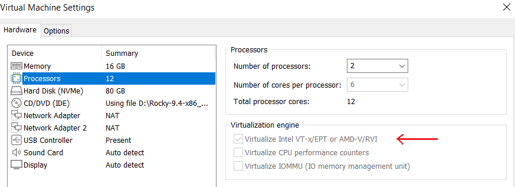

## 2. Configure Static IPs on VMs

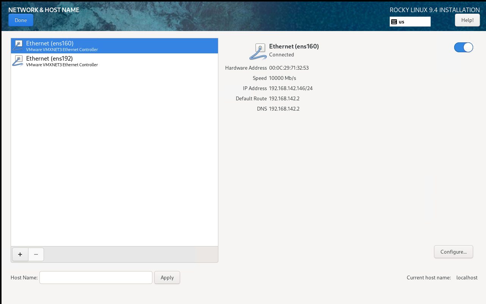

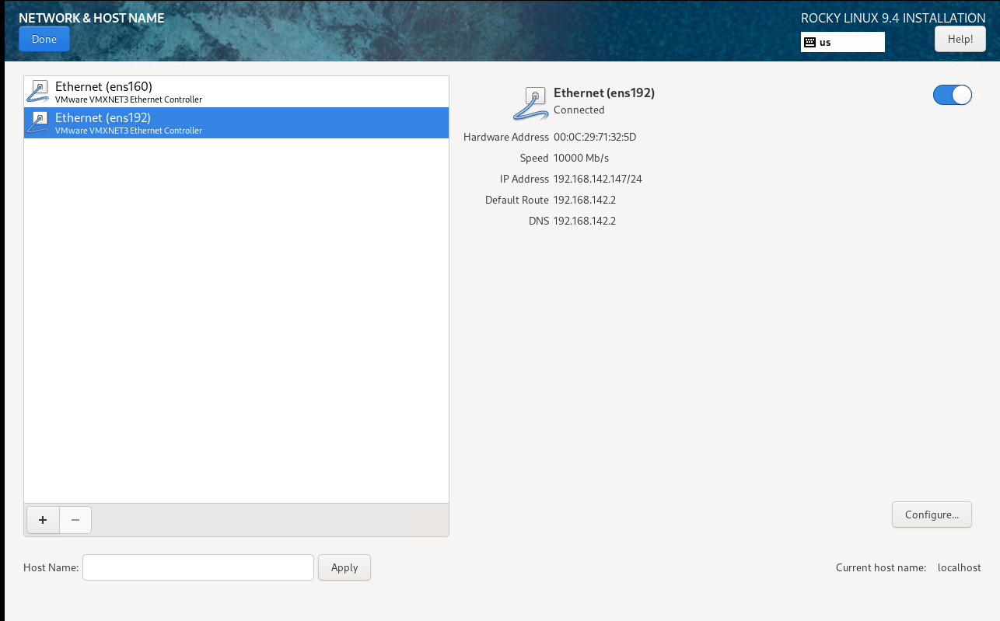

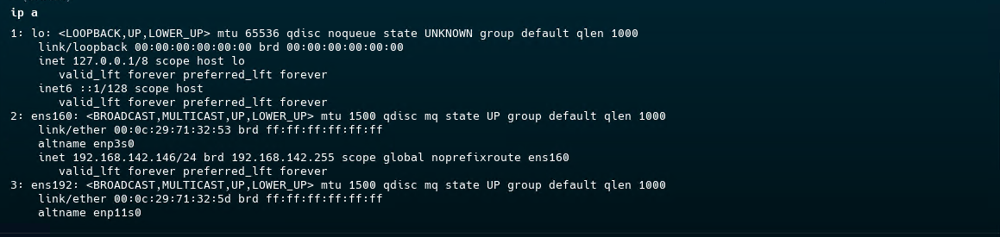

## 3. Set Hostnames and Networking in ( /etc/hosts )

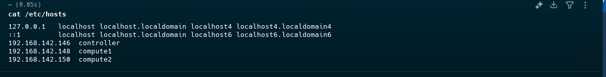


## 4. Set The Hostnames on the 3 Machines

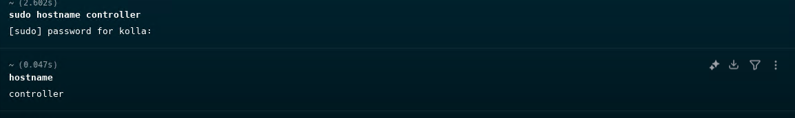

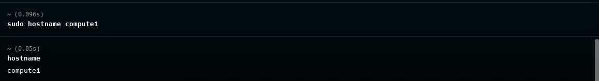

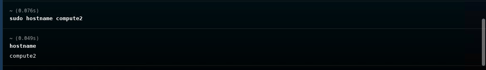


## 5.Install Dependencies on Controller Host

```
# Ensure the latest version of pip is installed
pip install -U pip

```

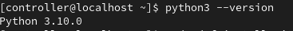

```
# update the system 
sudo dnf update 

# install dependencies 
sudo dnf install git python3-devel libffi-devel gcc openssl-devel python3-libselinux

```

## 6. Add User ( on the 3 machines : controller , 2 compute nodes )

```
su - 
adduser kolla
usermod -aG wheel kolla
passwd kolla ( Then Enter the kolla user password )
echo “kolla ALL=(ALL) NOPASSWD:ALL” | tee /etc/sudoers.d/kolla

```

## 7. Generate SSH key in Controller Node ( To Be Able To SSH To Compute Nodes )

```
ssh-keygen

```

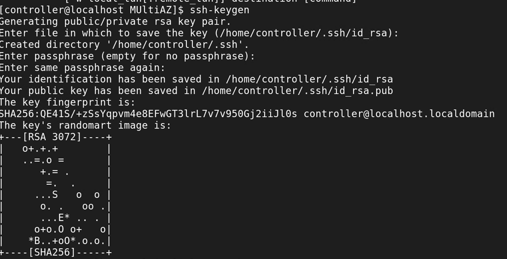


## 8. Copy Public SSH ID on Controller Host to Both of Compute Codes

```
ssh-copy-id -i /home/controller/.ssh/id_rsa.pub kolla@compute1 → Then enter yes

ssh-copy-id -i /home/controller/.ssh/id_rsa.pub kolla@compute2 → Then enter yes

```

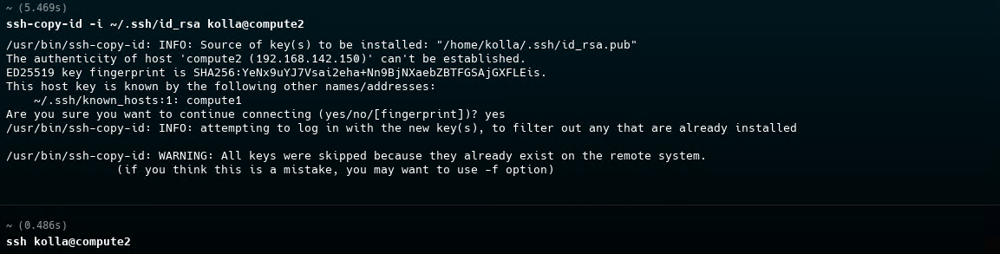

## 9. Try to SSH From Controller to Compute Nodes
- Note : Ensure that the sshd service is active in all machines ( systemctl status sshd ) and try to ssh from controller to compute nodes

```
ssh kolla@compute01

ssh kolla@compute02

```

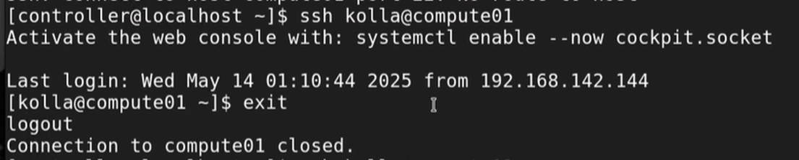

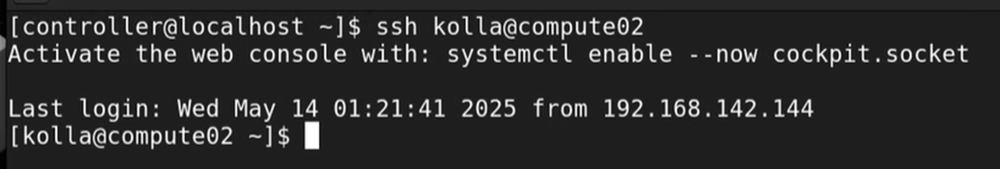

## 10. Install Kolla-ansible 

### A. Install Kolla Ansible Package using pip3 :
```
pip3 installl kolla-ansible

```
### B. Create the /etc/kolla directory :

```
sudo mkdir -p /etc/kolla

sudo chown $USER:$USER /etc/kolla

```

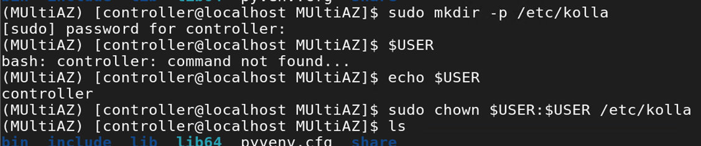

### C. Copy globals.yml and passwords.yml to /etc/kolla directory :

```
cp -r ./share/kolla-ansible/etc_examples/kolla/* /etc/kolla

ansible --version

```

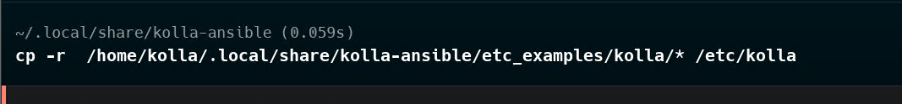


### D. Copy multinode inventory file to the current directory :

```
cp ./share/kolla-ansible/ansible/inventory/multinode .

kolla-ansible --version

```
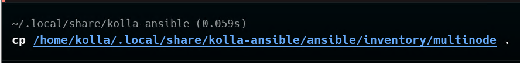

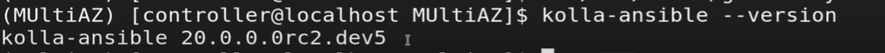

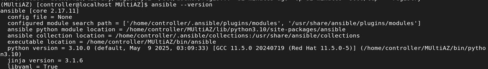


## 11. Install Ansible Galaxy requirements

```
kolla-ansible install-deps

```

## 12. Edit The Inventory File ( MultiAZ/inventory/multinode )
- Edit These Parts : 

```
[control]
controller

[network]
controller

[compute]
compute01
compute02

[monitoring]
controller


[storage]
controller

```

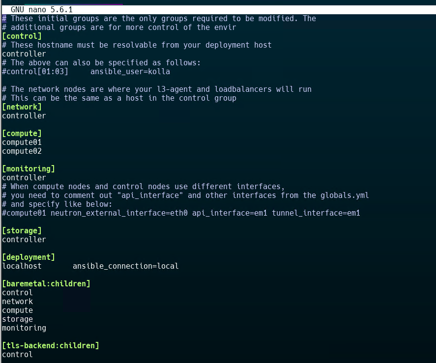


## 13. Kolla Passwords 

```
kolla-genpwd

```

## 14. Edit main configuration file for Kolla Ansible in etc/kolla/globals.yml
- Add this part at the beggining of the file : 

```
workaround_ansible_issue_8743: yes
config_strategy: "COPY_ALWAYS"
kolla_base_distro: "rocky"
openstack_release: "2024.2"
network_interface: "ens160"
neutron_external_interface: "ens192"
kolla_internal_vip_address: "192.168.142.160"
kolla_container_engine: docker
docker_configure_for_zun: "yes"
containerd_configure_for_zun: "yes"
docker_apt_package_pin: "5:20.*"
network_address_family: "ipv4"
neutron_plugin_agent: "openvswitch"
enable_openstack_core: "yes"
enable_glance: "{{ enable_openstack_core | bool }}"
enable_haproxy: "yes"
enable_keepalived: "{{ enable_haproxy | bool }}"
enable_keystone: "{{ enable_openstack_core | bool }}"
enable_mariadb: "yes"
enable_memcached: "yes"
enable_neutron: "{{ enable_openstack_core | bool }}"
enable_nova: "{{ enable_openstack_core | bool }}"
enable_aodh: "yes"
enable_etcd: "yes"
enable_gnocchi: "yes"
enable_gnocchi_statsd: "yes"
enable_heat: "{{ enable_openstack_core | bool }}"
enable_horizon: "{{ enable_openstack_core | bool }}"
enable_kuryr: "yes"
enable_zun: "yes"

```

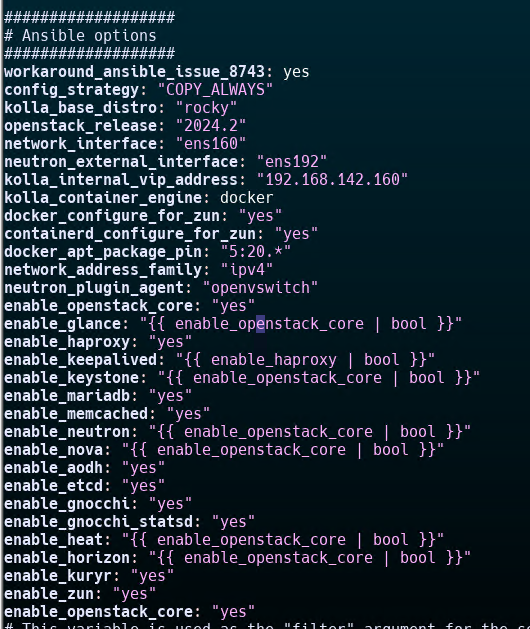


## 15. Deployment
### A. Bootstrap servers with kolla deploy dependencies :

```
kolla-ansible bootstrap-servers -i ./multinode

```

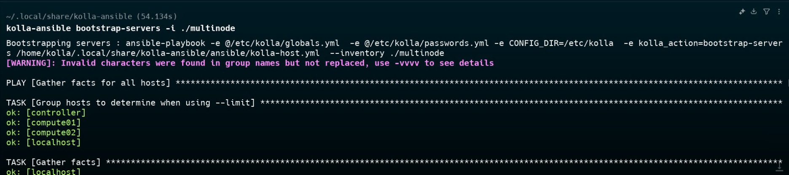

### B. Do pre-deployment checks for hosts :

```
kolla-ansible prechecks  -i ./multinode

```

### C. Validate before deployment : 

```
kolla-ansible validate-config -i ./multinode

```

### D. Finally proceed to actual OpenStack deployment :

```
kolla-ansible deploy  -i ./multinode

```

## 16. Using OpenStack
### A. Install the OpenStack CLI client :

```
pip install python-openstackclient -c https://releases.openstack.org/constraints/upper/master

source /openrc.sh  ( Contains Credentials of Openstack )

```
### B. OpenStack requires a clouds.yaml file where credentials for the admin user are set. To generate this file ( will be generated in /etc/kolla/clouds.yaml ) : 

```
kolla-ansible post-deploy

```

## 17. Creating the 2 AZs
### A. Create a new aggregate, associating it with an AZ in the process : 
```
openstack aggregate create --zone az1 my-aggregate

openstack aggregate create --zone az2 my-aggregate2

```

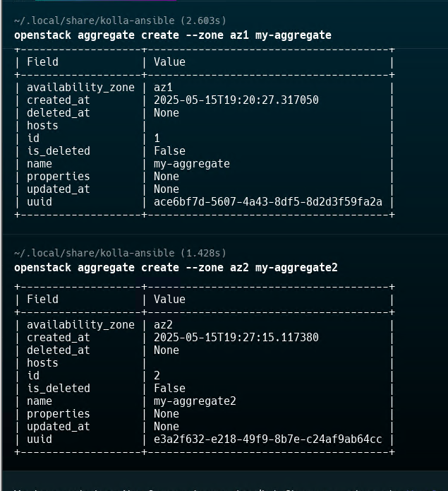


### B. Add host to it using the openstack client : 

```
openstack aggregate add host my-aggregate compute1

openstack aggregate add host my-aggregate2 compute2

```
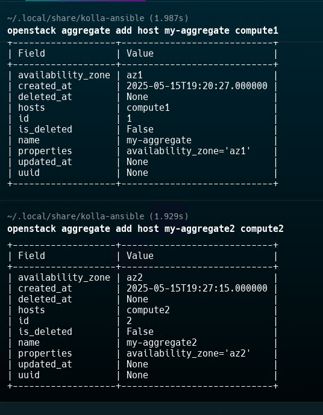

### C. List all host aggregates and show information about a specific aggregate : 

```
openstack aggregate list 

```

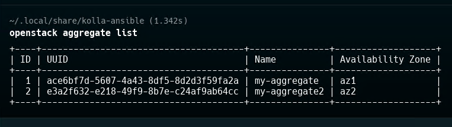


```
openstack aggregate show my-aggregate

openstack aggregate show my-aggregate2

```


## 18. Run This File /share/kolla-ansible/init-runonce To Create Demo Services

```
./init-runonce

```

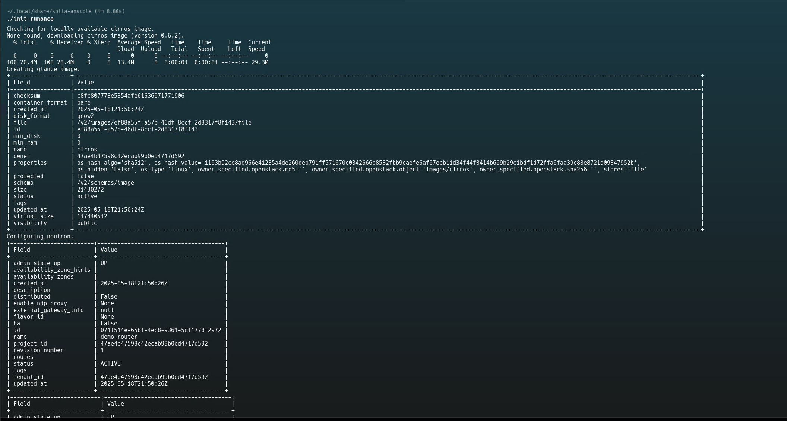


## 19. Access your Cloud

### A. Get Dashboard URL : 

```
cat /etc/kolla/clouds.yml

```
Take the auth_url till the IP Address without the port : http://<IP-Address>:<port>

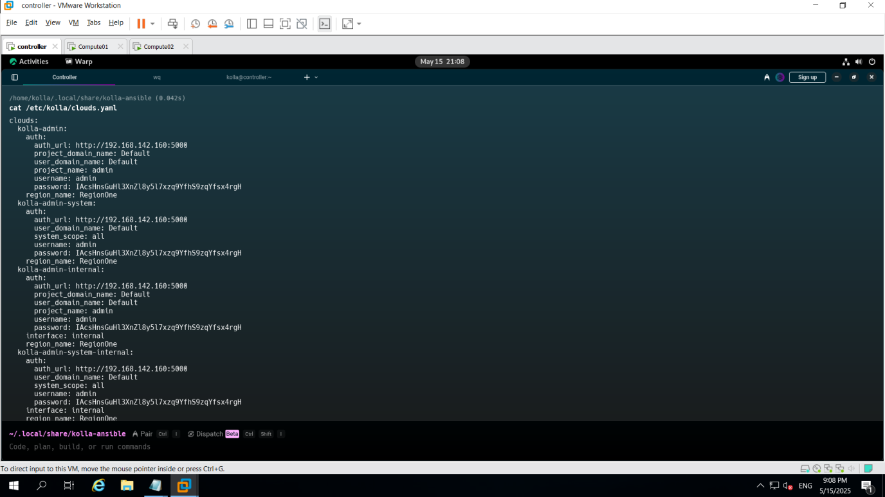


### B. Get admin user Password for your Cloud Dashboard : 

```
grep keystone_admin_password /etc/kolla/passwords.yml 

```

## 20. Verify Services

### A. Network Topology :

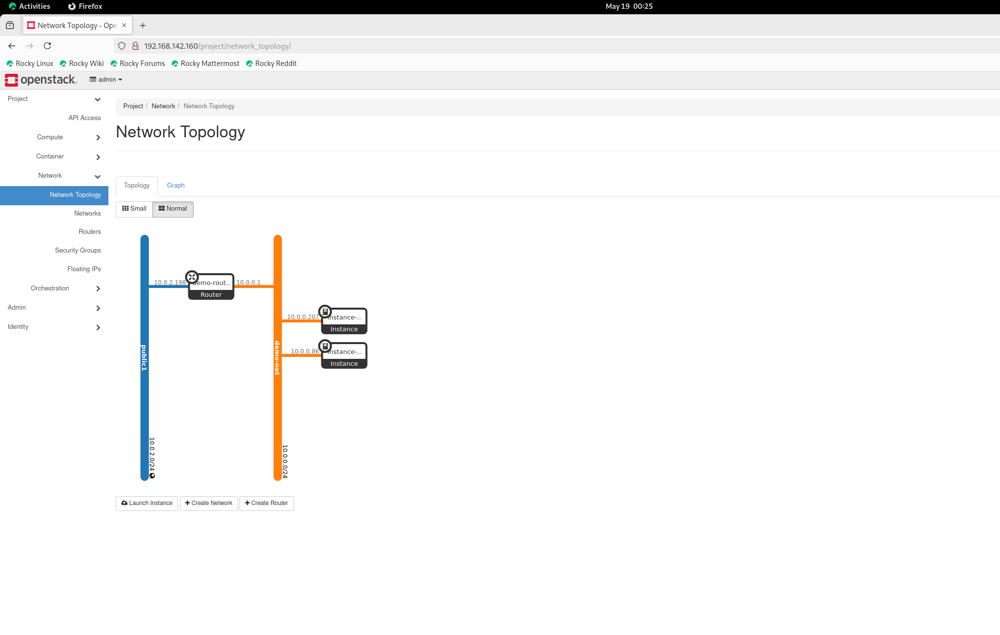

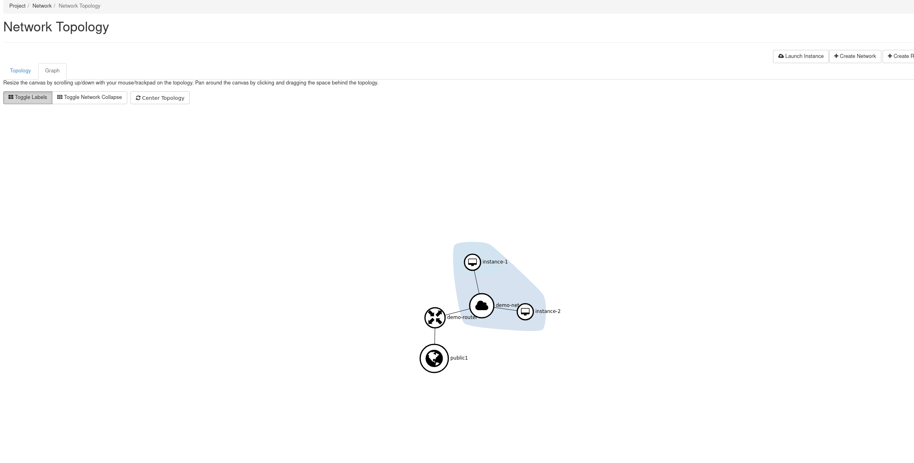

### B. Instances :

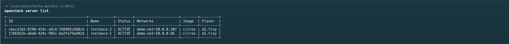

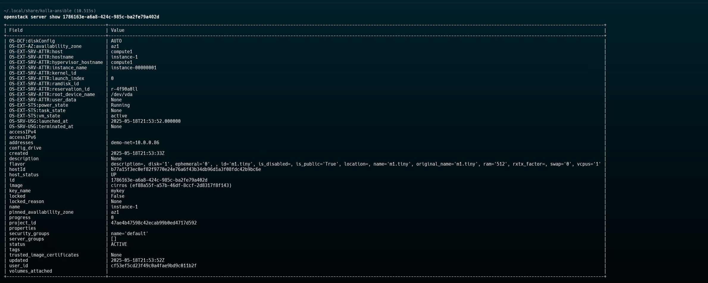

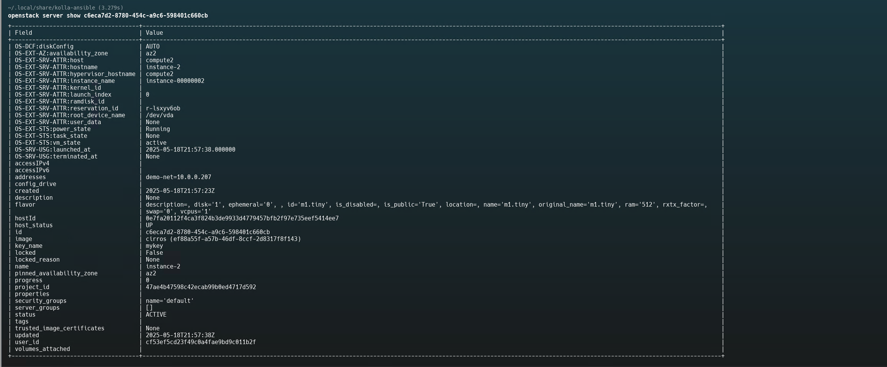

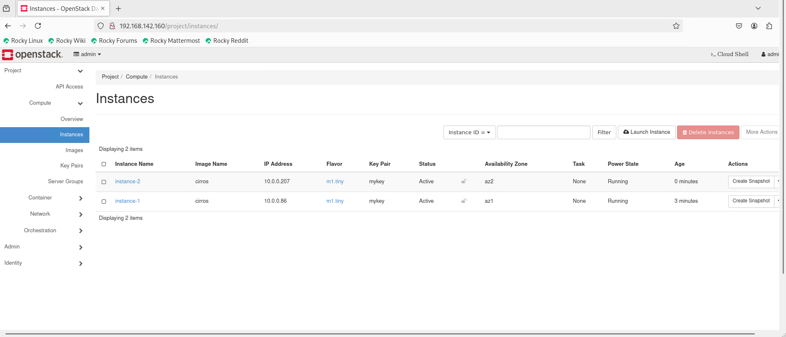

## 21. References

Main Guides : 
- For Deploying Openstack Cloud using kolla-ansible : https://docs.openstack.org/kolla-ansible/latest/user/quickstart.html
- For Creating AZs : https://docs.openstack.org/nova/latest/admin/availability-zones.html
